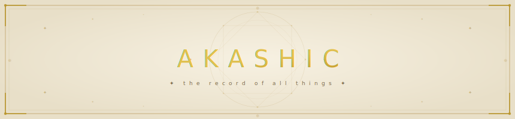

 

---

## About

> *"The Akashic Records — said to contain all knowledge of every soul, across all time..."*

Welcome to **Akashic**.

*I bind my knowledge to the archive. I name the difficulty, I choose the trial. From the pool of all I've written, let only the unseen rise — and may nothing repeat until its time has come.*

---

## Author

**~ Yumiko Kawaii ~**

*Software Engineer*

*コードよ、わがまほうとなれ*

---

*~ Built with mass amounts of coffee ~*

